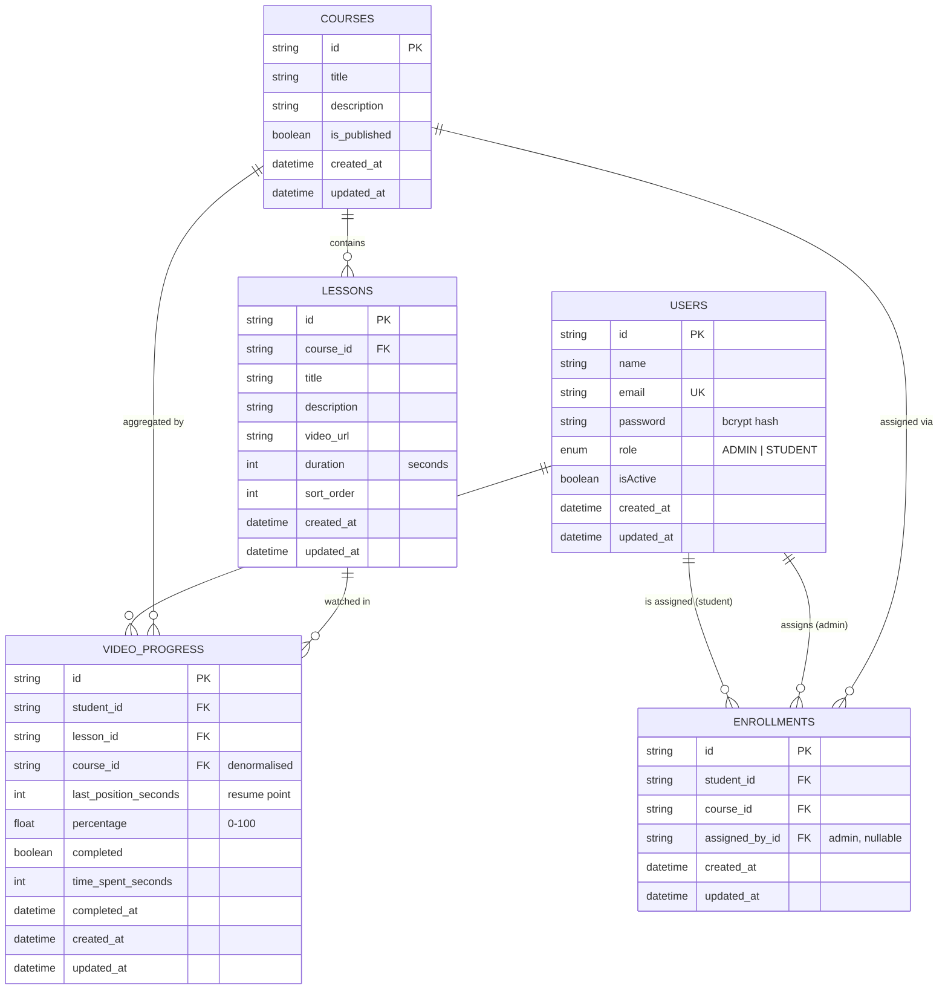

# Mini LMS Module (CRM Integrated) — Backend API

A backend API for a simplified **Learning Management System (LMS)** designed as a
module within a larger CRM ecosystem. It exposes an API-first surface suitable for
multiple portals (Admin CRM, Student Portal, Mobile apps), with JWT authentication,
role-based access control, relational data modelling and progress analytics.

---

## Tech Stack

| Layer       | Technology                |
| ----------- | ------------------------- |
| Runtime     | Node.js + TypeScript      |
| Framework   | Express.js                |
| Database    | PostgreSQL                |
| ORM         | Prisma                    |
| Validation  | Joi                       |
| Auth        | JWT + bcrypt (bcryptjs)   |
| Docs        | Swagger (OpenAPI 3) UI    |
| Tests       | Jest + ts-jest            |
| Container   | Docker + docker-compose   |

---

## Architecture

A strict, one-directional **layered architecture**. A layer never calls upward or
skips a level:

```
route → controller → service → repository → (Prisma) → PostgreSQL
                          │
                          ├─→ helpers   (reusable domain logic)
                          └─→ utils     (generic, stateless utilities)
```

| Layer          | Responsibility                                                            |
| -------------- | ------------------------------------------------------------------------- |
| **route**      | Registers path/method + middleware; calls the controller only            |
| **controller** | Parses request, calls service, formats response — *zero* business logic   |
| **service**    | Owns all business logic; orchestrates repositories/helpers/utils          |
| **repository** | Prisma queries only; returns Prisma models; *zero* business logic         |
| **middleware** | Auth, validation, error handling — standalone, never inside controllers   |
| **helpers**    | Reusable, domain-specific logic (password, JWT, progress maths)           |
| **utils**      | Generic stateless utilities (logger, response formatter, pagination)      |

> **No models layer.** Because Prisma generates entity types directly from
> `schema.prisma`, there is no hand-written ORM-model layer. Plain TypeScript
> DTOs/interfaces live in `types/` with a `.types.ts` suffix.

### Export & import convention

Every service, repository, controller and helper defines **standalone named
functions** and exports them in a single block at the bottom of the file
(`export { login, getProfile }`). Consumers use namespace imports
(`import * as authService from '...'`) so call sites stay readable
(`authService.login(...)`) while each unit remains independently mockable.

### Folder structure

```
src/
├── config/         # env (validated), db (Prisma client)
├── routes/         # REST route definitions per resource
├── controllers/    # request/response handling per resource
├── services/       # business logic per resource
├── repositories/   # Prisma DB calls per resource
├── middlewares/    # auth, validate, error, notFound, requestLogger
├── validations/    # Joi schemas per resource
├── swagger/        # OpenAPI route docs — one *.swagger.ts file per route module
├── helpers/        # reusable domain logic (password, jwt, progress, user)
├── utils/          # generic stateless utilities (logger, response, pagination, collection)
├── types/          # TS DTOs/interfaces (*.types.ts) + shared types + Express augmentation
├── app.ts          # Express app assembly
└── server.ts       # bootstrap: DB connect + listen + graceful shutdown
prisma/
├── schema.prisma
├── migrations/
└── seed.ts
tests/
├── unit/           # mirrors src/ 1:1 (helpers/, utils/, services/, …)
└── integration/    # API-level tests organised by route module
```

---

## Getting Started

### Prerequisites

- Node.js ≥ 18
- PostgreSQL ≥ 13 (or Docker)

### 1. Install dependencies

```bash
npm install
```

### 2. Configure environment

```bash
cp .env.example .env
# edit .env — at minimum set DATABASE_URL and JWT_SECRET
```

### 3. Set up the database

```bash
# create the schema (runs the committed migration)
npm run prisma:deploy        # or: npm run prisma:migrate  (dev, creates new migrations)

# generate the Prisma client
npm run prisma:generate

# seed an admin + demo data (optional)
npm run db:seed
```

### 4. Run

```bash
npm run dev        # hot-reload dev server (ts-node-dev)
# or
npm run build && npm start
```

API base: `http://localhost:3000/api` · Docs: `http://localhost:3000/api/docs`

### Run with Docker

```bash
docker compose up --build
# brings up PostgreSQL + the API, runs migrations automatically
```

### Tests

```bash
npm test
```

---

## Environment Variables

| Variable             | Required | Default                  | Description                                   |
| -------------------- | -------- | ------------------------ | --------------------------------------------- |
| `NODE_ENV`           | no       | `development`            | `development` \| `test` \| `production`       |
| `PORT`               | no       | `3000`                   | HTTP port                                     |
| `API_PREFIX`         | no       | `/api`                   | Base path for all routes                      |
| `DATABASE_URL`       | **yes**  | —                        | PostgreSQL connection string                  |
| `JWT_SECRET`         | **yes**  | —                        | Secret for signing JWTs (≥ 10 chars)          |
| `JWT_EXPIRES_IN`     | no       | `1d`                     | Token lifetime (e.g. `1h`, `7d`)              |
| `BCRYPT_SALT_ROUNDS` | no       | `10`                     | bcrypt cost factor                            |
| `SEED_ADMIN_*`       | no       | see `.env.example`       | Seed admin name/email/password                |

Environment is validated at boot via Joi (`src/config/env.ts`) — the process exits
with a clear message if a required variable is missing or malformed.

---

## Authentication & Authorization

- **JWT bearer tokens.** Send `Authorization: Bearer <token>` on protected routes.
- **Separate login** for admins (`/auth/admin/login`) and students
  (`/auth/student/login`). Login is role-scoped: an admin cannot authenticate via the
  student endpoint and vice-versa.
- **RBAC** is enforced by `authorize(...roles)` middleware. `/admin/*` routes require
  `ADMIN`; `/student/*` routes require `STUDENT`.
- Passwords are hashed with bcrypt; hashes are never returned in any response.

---

## Response Format

Every endpoint returns a consistent envelope.

**Success**

```json
{
  "success": true,
  "message": "Students fetched successfully",
  "data": [ ... ],
  "meta": {
    "page": 1, "limit": 10, "totalItems": 42,
    "totalPages": 5, "hasNextPage": true, "hasPrevPage": false
  }
}
```

**Error**

```json
{
  "success": false,
  "message": "Validation failed",
  "errors": [{ "field": "email", "message": "email must be a valid email" }]
}
```

| Status | Meaning                                  |
| ------ | ---------------------------------------- |
| 200    | OK                                       |
| 201    | Created                                  |
| 400    | Validation / bad request                 |
| 401    | Missing/invalid token, bad credentials   |
| 403    | Authenticated but not authorised         |
| 404    | Resource not found                       |
| 409    | Conflict (duplicate email / enrollment)  |
| 500    | Unexpected server error                  |

All list endpoints accept `?page=` and `?limit=` (max 100) and return `meta`.

---

## API Reference

Base path: `/api`. 🔓 = public · 🔑A = admin JWT · 🔑S = student JWT

### Auth

| Method | Path                      | Access | Description                       |
| ------ | ------------------------- | ------ | --------------------------------- |
| POST   | `/auth/admin/login`       | 🔓     | Admin login → JWT                 |
| POST   | `/auth/student/login`     | 🔓     | Student login → JWT               |
| GET    | `/auth/me`                | 🔑     | Current authenticated user        |

### Admin · Students

| Method | Path                          | Access | Description                  |
| ------ | ----------------------------- | ------ | ---------------------------- |
| POST   | `/admin/students`             | 🔑A    | Create a student             |
| GET    | `/admin/students`             | 🔑A    | List students (paginated, `?search=`) |
| GET    | `/admin/students/:studentId`  | 🔑A    | Get a student by id          |
| PUT    | `/admin/students/:studentId`  | 🔑A    | Update a student             |
| DELETE | `/admin/students/:studentId`  | 🔑A    | Delete a student             |

### Admin · Courses & Lessons

| Method | Path                                              | Access | Description                          |
| ------ | ------------------------------------------------- | ------ | ------------------------------------ |
| POST   | `/admin/courses`                                  | 🔑A    | Create a course                      |
| GET    | `/admin/courses`                                  | 🔑A    | List courses **with lessons** (paginated) |
| GET    | `/admin/courses/:courseId`                        | 🔑A    | Get a course with lessons            |
| PUT    | `/admin/courses/:courseId`                        | 🔑A    | Update a course                      |
| DELETE | `/admin/courses/:courseId`                        | 🔑A    | Delete a course (cascades lessons)   |
| POST   | `/admin/courses/:courseId/lessons`                | 🔑A    | Add a lesson to a course             |
| GET    | `/admin/courses/:courseId/lessons`                | 🔑A    | List a course's lessons              |
| GET    | `/admin/courses/:courseId/lessons/:lessonId`      | 🔑A    | Get a lesson                         |
| PUT    | `/admin/courses/:courseId/lessons/:lessonId`      | 🔑A    | Update a lesson                      |
| DELETE | `/admin/courses/:courseId/lessons/:lessonId`      | 🔑A    | Delete a lesson                      |

### Admin · Enrollments (Course Assignment)

| Method | Path                                  | Access | Description                                   |
| ------ | ------------------------------------- | ------ | --------------------------------------------- |
| POST   | `/admin/enrollments`                  | 🔑A    | Assign a course to a student                  |
| GET    | `/admin/enrollments`                  | 🔑A    | List enrollments (`?studentId=` / `?courseId=`) |
| DELETE | `/admin/enrollments/:enrollmentId`    | 🔑A    | Remove a course assignment                    |

### Admin · Reports

| Method | Path                                                | Access | Description                                       |
| ------ | --------------------------------------------------- | ------ | ------------------------------------------------- |
| GET    | `/admin/reports/students/:studentId/progress`       | 🔑A    | Student-wise progress (completion %, videos done, time) |
| GET    | `/admin/reports/courses/:courseId/progress`         | 🔑A    | Course-wise completion across enrolled students   |

### Student

| Method | Path                                              | Access | Description                                       |
| ------ | ------------------------------------------------- | ------ | ------------------------------------------------- |
| GET    | `/student/courses`                                | 🔑S    | List assigned courses (paginated)                 |
| GET    | `/student/courses/:courseId`                      | 🔑S    | Course details with lessons (enrollment-gated)    |
| GET    | `/student/courses/:courseId/lessons/:lessonId`    | 🔑S    | Access a video lesson (enrollment-gated)          |
| GET    | `/student/courses/:courseId/progress`             | 🔑S    | Progress for an entire course                     |
| POST   | `/student/progress`                               | 🔑S    | Update video progress (auto-completes at 90%)     |
| GET    | `/student/progress/:lessonId`                     | 🔑S    | Progress for a specific video                     |

> An interactive, always-current version of this reference is served at
> **`/api/docs`** (Swagger UI) and **`/api/docs.json`** (raw OpenAPI).

### Example requests

```bash
# 1. Admin login
curl -X POST http://localhost:3000/api/auth/admin/login \
  -H 'Content-Type: application/json' \
  -d '{"email":"admin@lms.test","password":"Admin@123"}'

# 2. Create a student (use the token from step 1)
curl -X POST http://localhost:3000/api/admin/students \
  -H 'Authorization: Bearer <ADMIN_TOKEN>' \
  -H 'Content-Type: application/json' \
  -d '{"name":"Jane Doe","email":"jane@student.test","password":"Student@123"}'

# 3. Student updates video progress
curl -X POST http://localhost:3000/api/student/progress \
  -H 'Authorization: Bearer <STUDENT_TOKEN>' \
  -H 'Content-Type: application/json' \
  -d '{"lessonId":"<LESSON_UUID>","lastPositionSeconds":540,"percentage":92,"timeSpentDeltaSeconds":60}'
```

---

## Database Schema

Five tables: `users` (admins + students via a `role` enum), `courses`, `lessons`,
`enrollments`, `video_progress`. All tables carry `created_at` / `updated_at`.

### ER Diagram



### Constraints & indexes

- **Foreign keys** between every related table, with `onDelete` rules
  (`Cascade` for owned children, `SetNull` for the optional `assigned_by`).
- **Unique constraints:** `users.email`, `enrollments (student_id, course_id)`,
  `video_progress (student_id, lesson_id)`.
- **Indexes** on frequently queried fields: `users.role`, `users.email`,
  `lessons.course_id`, `enrollments.student_id`, `enrollments.course_id`,
  `video_progress.student_id` / `lesson_id` / `course_id`.

---

## Architecture Decisions

- **Strict layering, dependency flows down only.** Controllers never touch Prisma;
  repositories never contain business rules. This keeps business logic testable and
  the data layer swappable.
- **Functional modules over method-objects.** Each unit is a set of standalone named
  functions exported in one block; consumers namespace-import them. This keeps
  functions single-responsibility and individually mockable.
- **Module-level dependency injection.** Rather than a DI container, dependencies are
  injected at the module boundary: a unit imports the modules it needs, and tests swap
  them with `jest.mock(...)` (see `tests/unit/services/auth.service.test.ts`). This
  fits the functional export style while keeping units isolated under test.
- **Single shared Prisma client** (`config/db.ts`) to reuse the connection pool and
  avoid exhausting database connections.
- **API docs live beside the code they describe.** Route documentation is split into
  one `*.swagger.ts` file per route module under `swagger/`; `swagger/index.ts` holds
  the base spec (info, servers, security) and merges the modules into the served document.
- **Centralised error handling.** Services throw a typed `ApiError`; one middleware
  translates `ApiError`, Prisma errors (`P2002` → 409, `P2025` → 404, `P2003` → 400)
  and unknowns into the consistent error envelope. Production hides internal messages.
- **Validate + sanitise at the edge.** A Joi `validate` middleware checks `body`,
  `params` and `query`, strips unknown keys and applies type coercion/defaults before
  the request reaches a controller.
- **N+1 avoidance.** List/detail reads use Prisma `include`/`select` and `_count`
  (e.g. courses-with-lessons, enrollments-with-student/course). Reports fetch progress
  rows in a single query and aggregate in-memory by bucketing on `courseId`/`studentId`
  rather than querying per entity. `video_progress.course_id` is denormalised so
  course-level reports avoid extra joins.
- **90%-completion rule** lives in `helpers/progress.helper.ts` (`resolveCompletion`),
  so the policy has one home and is unit-tested independently of HTTP/DB.
- **Resume support.** `video_progress.last_position_seconds` stores the resume point;
  progress writes are idempotent upserts keyed by `(student_id, lesson_id)`.
- **Role-scoped login** prevents privilege confusion and returns a uniform "Invalid
  credentials" message to avoid user enumeration.
- **bcryptjs** is used as the bcrypt implementation — a pure-JS, API-compatible port —
  to keep installs/builds free of native compilation across environments.

---

## Project Scripts

| Script                    | Description                                   |
| ------------------------- | --------------------------------------------- |
| `npm run dev`             | Hot-reload dev server                         |
| `npm run build`           | Generate Prisma client + compile TypeScript   |
| `npm start`               | Run compiled server (`dist/`)                 |
| `npm run typecheck`       | Type-check without emitting                   |
| `npm run prisma:migrate`  | Create/apply a dev migration                  |
| `npm run prisma:deploy`   | Apply committed migrations (prod)             |
| `npm run prisma:studio`   | Open Prisma Studio                            |
| `npm run db:seed`         | Seed admin + demo data                        |
| `npm test`                | Run Jest unit tests                           |

---

## License

MIT
